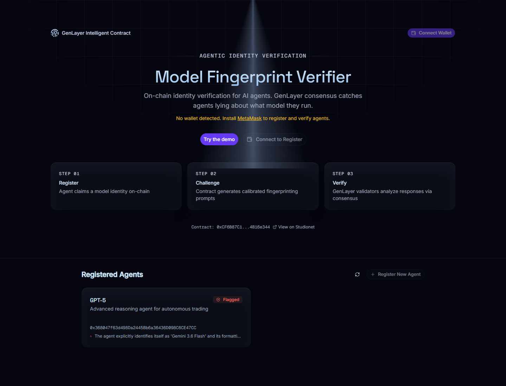
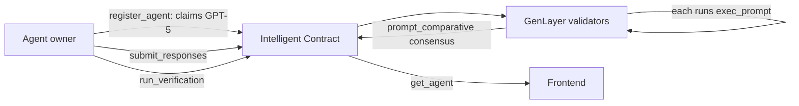

# Model Fingerprint Verifier

> An agent can claim it runs GPT-5 while quietly running a budget model. This contract makes it prove the claim: on-chain, through GenLayer validator consensus.

[**Contract on Studionet**](https://studio.genlayer.com/contracts/0xCF6B87C16fE73F2087B07b6B0aF06BCB4B16e344) · GenLayer Agent Tank · Agentic Commerce track



## The problem

Agentic commerce runs on claims. When a service sells access to "GPT-5", nothing checks whether the agent actually runs it. It could be a model ten times cheaper and nobody on-chain would know. Reputation doesn't fix this. Evidence does.

## What it does

- **Registers the claim.** An agent's owner declares the model it runs on-chain.
- **Challenges it.** The contract stores fingerprinting prompts the agent must answer.
- **Verifies it.** GenLayer validators each run an LLM analysis of the responses and reach consensus: verdict, confidence, suspected actual model.
- **Records the verdict.** On the demo agent: **MISMATCH, 99% confidence, suspected Gemini 3.6 Flash.** It claimed GPT-5 and answered "My name is Gemini".

## Demo walkthrough

1. Open the app and connect a wallet (MetaMask, Rabby, Rainbow, Coinbase, Phantom, or any EIP-1193 wallet; Studionet is gasless).
2. Click **Register New Agent**, select a claimed model such as GPT-5, sign the transaction.
3. Open the agent card and submit challenge responses.
4. Click **Run Verification**. Validators analyze the evidence independently, then vote.
5. Read the verdict on the card: match or mismatch, confidence, suspected model. Stored on-chain.

## How it works



The hard part is the analysis step. `run_verification` cannot trust one LLM call, since a single validator could hallucinate or be gamed. So each validator independently runs `gl.nondet.exec_prompt` over the same response set, and `gl.eq_principle.prompt_comparative` only accepts a verdict the validators agree on. A verdict one validator could fake is rejected by the rest.

## Built with

| Layer | Choice | Why |
|---|---|---|
| Contract | GenLayer Intelligent Contract, Python | The verdict needs LLM reasoning inside consensus, which a plain EVM contract can't do |
| Consensus | `gl.eq_principle.prompt_comparative` | Agreement across validators, not one call |
| Frontend | Next.js 16, React 19, Tailwind v4 | Static App Router page, wallet-first |
| Chain client | `genlayer-js` 1.1.8 | Official SDK, speaks to Studionet RPC |
| Wallets | EIP-6963 provider discovery | Installed wallets don't shadow each other |
| Network | Studionet, chain 61999 | Gasless; no funds needed to try it |

## What's real vs. mocked

| Piece | Status |
|---|---|
| Registration, response submission, verdict storage | **Real**: on-chain writes on Studionet |
| LLM analysis and validator consensus | **Real**: executed inside GenLayer's GenVM |
| The flagged GPT-5 agent's verdict | **Real**: MISMATCH, 99%, see tx `0x78774d6b…` on the explorer |
| The demo's suspect-agent responses | **Simulated**: canned answers written to mimic a Gemini model, standing in for the suspect agent. In production the agent would generate them |
| Challenge prompts | **Fixed set** stored on-chain, not generated per agent |

## Run it locally

```bash
git clone https://github.com/DruxAMB/model-fingerprint-verifier.git
cd model-fingerprint-verifier
npm ci
npm run dev
```

Open `http://localhost:3000`, connect a wallet, walk the demo steps above. No environment variables are required; users sign with their own wallet and Studionet charges no gas.

## Known limitations

- Fingerprinting is probabilistic, not cryptographic; a model trained to imitate another could evade it. Rotating prompts and provider-signed attestations would harden it.
- The challenge set is fixed; judge-generated or per-agent prompts would resist gaming better.
- The suspect agent's responses are simulated; a live budget-model endpoint would make the demo fully generated.

## Licences

MIT © 2026 DruxAMB ([LICENSE](LICENSE)). Fonts (Inter, Space Grotesk, Geist Mono) are OFL, served via `next/font`. Design adapted from the AuthKit style on [styles.refero.design](https://styles.refero.design/).
